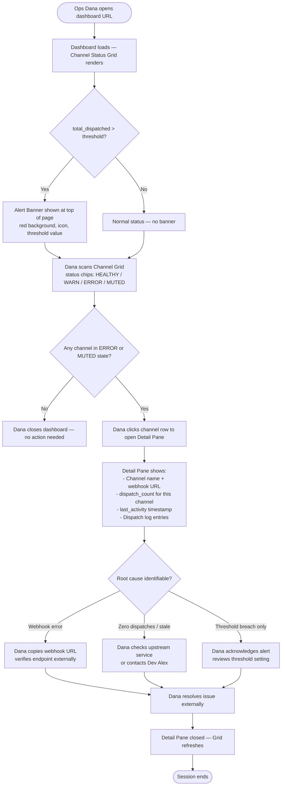
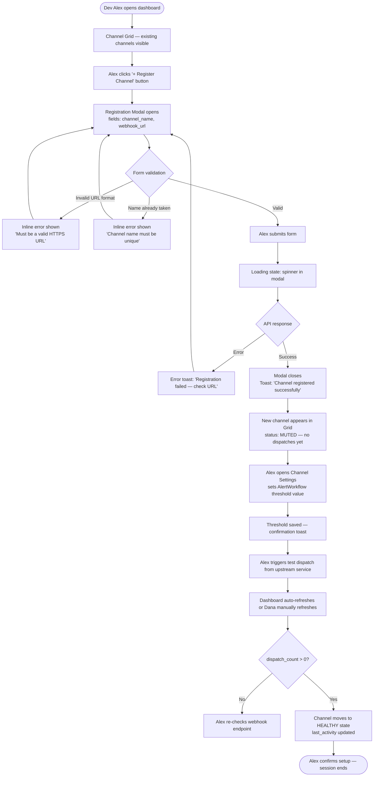

# UX Specification: Notification Channel Dashboard

**Orchestrated by:** UX-Atlas  
**Date:** 2026-03-23  
**Status:** REVIEWED — Ready for Frontend Handoff  
**Target file:** `demos/optional-packs-live-demo/ux-notification-dashboard-spec.md`

---

> **UX Goal:** Provide DevOps engineers with a single-pane-of-glass dashboard to monitor notification channel health, triage alert threshold breaches, and hand off channel configuration to developers — all without requiring them to query backend APIs manually.

---

## STEP 1 — UX-Planner: Structured UX Brief

**Specialist:** UX-Planner  
**Output status:** `BRIEF_READY`

---

### 1.1 User Problem Statement

Operators running distributed systems need to know, at a glance, whether their notification channels are functioning correctly, how much traffic each channel is handling, and whether any alert threshold has been triggered. Currently, this requires querying backend stats manually or reading logs. The dashboard eliminates that gap by surfacing `NotificationHub` data and `AlertWorkflow` state in a purpose-built UI.

---

### 1.2 Personas

#### Primary — "Ops Dana" (DevOps Engineer)

| Attribute | Detail |
|---|---|
| Role | Site Reliability / DevOps Engineer |
| Context | Desktop browser, internal ops dashboard, on-call rotation |
| Frequency | Low-frequency, high-urgency — checks on alert noise or incident |
| Technical level | High — comfortable with webhooks, JSON payloads, timestamps |
| Primary pain points | Spotting broken/muted channels; knowing if an alert is already triggered |
| Success criteria | Can assess full channel health status in under 30 seconds |

#### Secondary — "Dev Alex" (Developer / Integrator)

| Attribute | Detail |
|---|---|
| Role | Backend or integration developer |
| Context | Desktop browser, configuring channels during feature work |
| Frequency | Occasional — registers channels, adjusts thresholds |
| Technical level | High — owns webhook contracts and alert logic |
| Primary pain points | Verifying a newly registered channel is receiving dispatches |
| Success criteria | Can register channel, set threshold, and confirm first dispatch in one session |

---

### 1.3 Key User Goals

1. **Monitor channel health** — see `total_dispatched`, `per_channel_count`, `last_activity` for all channels at once
2. **Identify muted or broken channels** — detect channels with zero dispatches, stale `last_activity`, or webhook errors
3. **Respond to alert threshold breaches** — see `AlertWorkflow` alert state and the threshold value that was breached
4. **Register and configure channels** — add webhook URL, channel name, and set `AlertWorkflow` threshold (Dev Alex)
5. **Drill into channel detail** — view full dispatch history and metadata for a single channel

---

### 1.4 Context of Use

- **Device:** Desktop browser (1280 px minimum viewport width assumed)
- **Network:** Internal corporate network — no public internet dependency
- **Auth model:** Operator-level RBAC assumed; read access by default, write access to register/configure
- **Session pattern:** Typically opened on a specific incident or scheduled check; not a persistent dashboard tab

---

### 1.5 Key UX Risks

| Risk | Severity | Mitigation |
|---|---|---|
| Alert state conveyed by colour alone | High | Add icon + text label alongside colour coding |
| "Muted" vs "broken" channels look identical | High | Show `last_activity` age and dispatch error flag distinctly |
| Timestamp timezone ambiguity | Medium | Display timestamps in user's local timezone with UTC offset shown |
| Threshold value not visible on main grid | Medium | Show threshold in alert banner and channel detail pane |
| Bulk-action gap (no multi-channel reset) | Low | Note for v2; single-channel actions sufficient for MVP |

---

### 1.6 Open Questions

1. Does `get_stats()` return an error field per channel, or is webhook failure inferred from zero dispatches?
2. Is the `AlertWorkflow` threshold a global value or per-channel?
3. Can operators reset `total_dispatched` counters, or is that a developer action only?
4. What is the polling interval for live updates — WebSocket or REST polling?

---

## STEP 2 — User-Flow-Designer: Interaction Flow Diagrams

**Specialist:** User-Flow-Designer  
**Output status:** `FLOWS_READY`

---

### 2.1 Primary Flow — Operator Monitors and Responds to Alert

**Actor:** Ops Dana | **Trigger:** On-call alert fires or scheduled check



---

### 2.2 Secondary Flow — Developer Registers Channel and Monitors First Dispatches

**Actor:** Dev Alex | **Trigger:** New integration requires a notification channel



---

### 2.3 Decision Points and Error States Summary

| State | Trigger | Visual Treatment |
|---|---|---|
| HEALTHY | dispatch_count > 0 AND last_activity < 1 hr ago | Green chip |
| WARN | last_activity between 1–24 hr ago | Amber chip |
| MUTED | dispatch_count == 0 ever | Grey chip |
| ERROR | webhook failure flag OR last_activity > 24 hr | Red chip |
| ALERT_TRIGGERED | total_dispatched > threshold | Red banner at top |
| LOADING | API call in progress | Skeleton rows in grid |
| EMPTY | No channels registered | Empty state illustration + CTA |

---

### 2.4 API Endpoints Flagged for Backend-Atlas

- `GET /channels` — returns all channel names, dispatch counts, last_activity
- `GET /stats` — returns total_dispatched, per_channel map, threshold value, alert_triggered flag
- `POST /channels` — registers a new channel (name, webhook_url)
- `PUT /channels/{name}/threshold` — updates AlertWorkflow threshold (if per-channel)
- `GET /channels/{name}/log` — returns dispatch log entries for detail pane

---

## STEP 3 — Design-Critic: Heuristic Evaluation

**Specialist:** Design-Critic  
**Output status:** `APPROVED` (with 3 Major issues requiring resolution before implementation)

---

### 3.1 Nielsen's 10 Heuristics Evaluation

| # | Heuristic | Score (1–5) | Finding | Recommendation |
|---|---|---|---|---|
| 1 | Visibility of system status | 3 | Alert banner shows threshold breach, but grid rows do not show live refresh state. Users cannot tell if data is stale. | Add a "Last updated X seconds ago" indicator in the dashboard header with an auto-refresh countdown. |
| 2 | Match between system and real world | 4 | "Dispatched" and "last_activity" are developer-facing terms. Ops users may not know what a "dispatch" is. | Rename "dispatched" to "notifications sent" and "last_activity" to "last notification" in UI labels. Keep technical IDs in tooltips. |
| 3 | User control and freedom | 3 | No clear way to dismiss the alert banner once acknowledged. Refreshing the page resets context. | Add an "Acknowledge" button on the alert banner that persists the acknowledgment in session state. |
| 4 | Consistency and standards | 4 | Status chip colours align with traffic-light convention. Registration modal follows standard form patterns. Minor: the "+" button label should read "Register Channel" not just "+". | Ensure button labels are always present alongside icons, not icon-only. |
| 5 | Error prevention | 2 | The webhook URL field does not prevent submission of HTTP (non-HTTPS) URLs. Non-HTTPS webhooks are a security risk and will likely fail. | Validate HTTPS scheme on the client before submission. Show inline warning if user types `http://`. |
| 6 | Recognition rather than recall | 2 | The detail pane shows raw timestamps in ISO 8601. Users must mentally calculate elapsed time. Channel names in the grid have no tooltip showing the webhook URL. | Show relative time ("3 hours ago") alongside ISO timestamp. Add webhook URL as a truncated shown-on-hover label in the grid. |
| 7 | Flexibility and efficiency of use | 3 | No keyboard shortcut to open detail pane; no URL-addressable channel detail (deep linking). Power users cannot bookmark a specific channel. | Add deep-link URL pattern `/channels/{name}` so operators can bookmark or share a channel's detail view. |
| 8 | Aesthetic and minimalist design | 4 | The grid is the correct primary element. Alert banner is appropriately prominent. Watch for information overload if per-channel log is shown inline. | Keep per-channel log in the detail pane only; never show it in the grid. Limit grid columns to: name, status, notifications sent, last notification. |
| 9 | Help users recognise, diagnose, and recover from errors | 3 | Registration failure toast says "Registration failed — check URL" but gives no specific reason. Webhook error in grid shows ERROR chip but no description. | Error messages must include a specific cause (e.g., "401 Unauthorized — webhook rejected the payload"). Map known HTTP error codes to human-readable explanations. |
| 10 | Help and documentation | 3 | No in-context help for non-obvious fields (e.g., what "threshold" means in AlertWorkflow context). New users may not know how to configure the workflow correctly. | Add a tooltip (?) icon next to "Alert Threshold" that explains the field with an example value. |

---

### 3.2 Priority Issue List

| Priority | Issue | WCAG / Heuristic | Recommended Fix |
|---|---|---|---|
| Critical | HTTP webhook accepted without warning | H5 — Error Prevention | Block or warn on `http://` URLs; enforce HTTPS |
| Major | No "last updated" freshness indicator | H1 — Visibility of Status | Add header timestamp with auto-refresh |
| Major | Raw ISO timestamp requires mental parsing | H6 — Recognition vs Recall | Show relative time + absolute in tooltip |
| Major | Alert cannot be acknowledged | H3 — User Control | Add acknowledge action to alert banner |
| Minor | Icon-only "+" button | H4 — Consistency | Add visible text label |
| Minor | No deep-link to channel detail | H7 — Flexibility | Implement URL `/channels/{name}` |

---

### 3.3 Verdict

`NEEDS_REVISION` — 1 Critical (HTTPS enforcement) and 3 Major issues must be resolved before the handoff spec is marked implementation-ready. The Critical issue is a security concern, not only UX.

---

## STEP 4 — Accessibility-Heuristics: WCAG 2.1 AA Review

**Specialist:** Accessibility-Heuristics  
**Output status:** `NEEDS_REVISION` — 2 WCAG violations must be resolved

---

### 4.1 Accessibility Checklist

| # | Criterion | WCAG SC | Status | Detail |
|---|---|---|---|---|
| 1 | **Colour contrast — alert red text on red banner background** | 1.4.3 (AA) | ⚠️ FAIL | White text on #D32F2F red passes (5.7:1) but any dark text on the same red fails. Spec must mandate white text only on red surfaces. |
| 2 | **Colour contrast — status chips (green, amber, red, grey)** | 1.4.3 (AA) | ⚠️ FAIL | Amber (#FFC107) with white text fails (2.1:1). Requires dark text (#212121) on amber chips. |
| 3 | **Information conveyed by colour alone — status chips** | 1.4.1 | ⚠️ FAIL | Status is currently colour-coded only. Must add text label inside the chip ("HEALTHY", "WARN", "ERROR", "MUTED") or an icon with an accessible name. |
| 4 | **Keyboard navigation — channel grid rows** | 2.1.1 | ✅ PASS (conditional) | Each grid row must be a focusable element (`role="row"` with `tabindex="0"` or a link). Verify that pressing Enter on a focused row opens the detail pane. |
| 5 | **Focus management — opening detail pane** | 2.4.3 | ⚠️ FAIL | When the detail pane opens, focus must move to the pane's heading or close button. Without this, keyboard users lose their position. |
| 6 | **Focus management — closing detail pane** | 2.4.3 | ⚠️ FAIL | When the detail pane is closed, focus must return to the channel row that opened it. |
| 7 | **Screen reader labels — status chips** | 4.1.2 | ⚠️ FAIL | If chips are implemented as `<span>` with background colour, they have no accessible name. Use `role="status"` or `aria-label="Channel status: HEALTHY"`. |
| 8 | **Screen reader labels — alert banner** | 4.1.3 (AA) | ⚠️ FAIL | Dynamic alert banner must use `role="alert"` or `aria-live="assertive"` so screen readers announce it immediately when it appears. |
| 9 | **Registration modal — focus trap** | 2.1.2 | ⚠️ FAIL | Modal must trap focus inside while open. Tab must cycle through modal interactive elements only; nothing behind the modal should receive focus. |
| 10 | **Registration modal — error messages linked to fields** | 1.3.1, 3.3.1 | ✅ PASS (conditional) | Inline errors must use `aria-describedby` pointing to the error message element. The error text must be programmatically associated with the input. |
| 11 | **Timestamp — machine-readable time element** | 1.3.1 | ⚠️ FAIL | Relative time labels ("3 hours ago") must be wrapped in `<time datetime="2026-03-23T10:00:00Z">3 hours ago</time>` so assistive technology can read the actual value. |
| 12 | **Touch targets — register button and chip links** | 2.5.5 (AAA reference; best practice for AA) | ✅ PASS (conditional) | Dashboard is desktop-first. Minimum 40×40 px targets are acceptable. Confirm button height ≥ 40 px in design tokens. |

---

### 4.2 Critical Accessibility Issues

| Priority | Issue | WCAG SC | Fix |
|---|---|---|---|
| Critical | Alert banner not announced to screen readers | 4.1.3 | Add `role="alert"` to the banner container |
| Critical | Status chips colour-only — no text or icon | 1.4.1 | Add visible text label in chip |
| Critical | Amber chip fails contrast with white text | 1.4.3 | Use dark text (#212121) on amber |
| Major | Focus not managed when detail pane opens/closes | 2.4.3 | Implement focus-send on open, focus-return on close |
| Major | Modal does not trap focus | 2.1.2 | Implement focus trap in modal component |
| Minor | Timestamps not wrapped in `<time>` element | 1.3.1 | Use semantic `<time datetime="...">` |

---

### 4.3 Verdict

`NEEDS_REVISION` — 3 Critical and 2 Major accessibility issues must be resolved. All Critical items are implementable without redesigning the flows; they are implementation-level fixes for Afrodita.

---

## STEP 5 — Frontend-Handoff: Implementation Bundle

**Specialist:** Frontend-Handoff  
**Output status:** `HANDOFF_READY`  
**Recommended target:** `Afrodita` (frontend implementation) + `Backend-Atlas` (API contracts)

---

### 5.1 Component Inventory

| Component | Description | Notes |
|---|---|---|
| `DashboardShell` | Root layout: header, main content area, toaster region | Contains refresh indicator and route outlet |
| `AlertBanner` | Full-width banner shown when alert is triggered | `role="alert"`, dismissable with Acknowledge button |
| `ChannelGrid` | Data table of all registered channels | Keyboard-navigable rows, sortable columns |
| `ChannelGridRow` | Single row in the grid | Focusable, Enter/click opens detail pane |
| `StatusChip` | Coloured chip with text label for channel status | Must include text label + `aria-label` |
| `ChannelDetailPane` | Slide-in or split-pane detail view for a single channel | Focus-managed on open/close |
| `DispatchLog` | Scrollable list of recent dispatch log entries | Shown only inside detail pane |
| `RegisterChannelModal` | Modal form to add a new channel | Focus-trapped, accessible error messages |
| `ChannelForm` | Form fields: name, webhook_url | HTTPS validation, `aria-describedby` errors |
| `ThresholdEditor` | Number input to set AlertWorkflow threshold | Tooltip (?) with explanation |
| `RefreshIndicator` | "Last updated X seconds ago" in header | Updates on each poll cycle |
| `EmptyState` | Shown when no channels are registered | Illustration + "Register your first channel" CTA |
| `LoadingSkeleton` | Skeleton rows during grid load | `aria-busy="true"` on grid container |
| `ToastNotification` | Success/error toast region | `role="status"` for success, `role="alert"` for error |

---

### 5.2 Data Bindings — `get_stats()` → UI Elements

| `get_stats()` Field | UI Element | Binding Notes |
|---|---|---|
| `total_dispatched` | `AlertBanner` — threshold comparison | Compare against `threshold`; show banner if exceeded |
| `total_dispatched` | `DashboardShell` header | Show as summary stat "Total notifications: N" |
| `threshold` | `AlertBanner` body text | "Threshold of {threshold} has been exceeded" |
| `threshold` | `ThresholdEditor` initial value | Pre-populate the input field |
| `alert_triggered` | `AlertBanner` visibility | Show/hide banner based on boolean |
| `per_channel_counts[name]` | `ChannelGridRow` — "Notifications Sent" column | Display as formatted integer |
| `channels[name].last_activity` | `ChannelGridRow` — "Last Notification" column | Render as relative time + `<time datetime>` |
| `channels[name].last_activity` | `StatusChip` — HEALTHY/WARN/ERROR logic | Derive status from age of last_activity |
| `channels[name].webhook_url` | `ChannelDetailPane` — webhook URL field | Shown truncated in grid, full in pane |
| `channels[name].status_error` | `StatusChip` — ERROR state | If error flag present, override status to ERROR |

---

### 5.3 State Machines

#### 5.3.1 Dashboard-Level States

```
LOADING ──────────────────────────────────────────────────────► NORMAL
   │                                                               │
   │                                              total_dispatched > threshold
   │                                                               │
   └─ API error ───► ERROR_STATE                                   ▼
                                                           ALERT_TRIGGERED
                                                               │
                                                          user acknowledges
                                                               │
                                                               ▼
                                                         ALERT_ACKNOWLEDGED
                                                    (banner dismissed, count still shown)
```

#### 5.3.2 Channel-Level States

```
MUTED ──► (first dispatch received) ──► HEALTHY
  │                                         │
  │                                   last_activity 1–24 hr ago
  │                                         │
  │                                         ▼
  │                                       WARN
  │                                         │
  │                                   last_activity > 24 hr
  │                                    OR error flag
  │                                         │
  └─────────────────────────────────────►  ERROR
```

#### 5.3.3 Registration Modal States

```
CLOSED ──► OPEN (idle) ──► VALIDATING ──► SUBMITTING ──► SUCCESS ──► CLOSED
                │                │              │
                │           validation      API error
                │             error            │
                └─────────────────────────────►OPEN (error shown)
```

#### 5.3.4 Detail Pane States

```
CLOSED ──► OPENING (focus moves to pane) ──► OPEN
                                               │
                                         user presses Escape
                                          or clicks Close
                                               │
                                        CLOSING (focus returns to row)
                                               │
                                             CLOSED
```

---

### 5.4 Design Tokens — Status Colour Palette

| Token Name | Hex Value | Usage | Contrast Note |
|---|---|---|---|
| `--color-status-healthy` | `#2E7D32` | HEALTHY chip background | White text: 7.1:1 ✅ |
| `--color-status-healthy-text` | `#FFFFFF` | HEALTHY chip text | See above |
| `--color-status-warn` | `#FFC107` | WARN chip background | Dark text required |
| `--color-status-warn-text` | `#212121` | WARN chip text | 13.4:1 on amber ✅ |
| `--color-status-error` | `#D32F2F` | ERROR chip background | White text: 5.7:1 ✅ |
| `--color-status-error-text` | `#FFFFFF` | ERROR chip text | See above |
| `--color-status-muted` | `#757575` | MUTED chip background | White text: 4.6:1 ✅ |
| `--color-status-muted-text` | `#FFFFFF` | MUTED chip text | See above |
| `--color-alert-banner-bg` | `#B71C1C` | Alert banner background | White text only |
| `--color-alert-banner-text` | `#FFFFFF` | Alert banner text | 7.1:1 on banner bg ✅ |
| `--color-surface-default` | `#FAFAFA` | Page background | — |
| `--color-surface-pane` | `#FFFFFF` | Detail pane background | — |
| `--color-border-default` | `#E0E0E0` | Grid row dividers | — |
| `--color-text-primary` | `#212121` | Primary text | 16:1 on white ✅ |
| `--color-text-secondary` | `#616161` | Secondary / metadata text | 5.9:1 on white ✅ |
| `--color-focus-ring` | `#1565C0` | Focus outline for keyboard nav | 3:1 on white ✅ |

---

### 5.5 Open Issues for Afrodita

| # | Issue | Priority | From Specialist |
|---|---|---|---|
| 1 | Alert banner must use `role="alert"` | Critical | Accessibility-Heuristics |
| 2 | Amber chip must use dark text (#212121) | Critical | Accessibility-Heuristics |
| 3 | Status chips must include text label, not colour only | Critical | Accessibility-Heuristics |
| 4 | HTTPS-only validation on webhook URL field | Critical | Design-Critic |
| 5 | Focus must move to detail pane on open and return on close | Major | Accessibility-Heuristics |
| 6 | Registration modal must trap focus | Major | Accessibility-Heuristics |
| 7 | Add "Last updated X seconds ago" indicator in header | Major | Design-Critic |
| 8 | Relative timestamps with `<time datetime>` element | Major | Accessibility-Heuristics |
| 9 | Alert banner must have Acknowledge button | Major | Design-Critic |
| 10 | Add tooltip (?) to Alert Threshold field | Minor | Design-Critic |
| 11 | Grid rows must show webhook URL on hover | Minor | Design-Critic |
| 12 | Implement deep-link URL `/channels/{name}` | Minor | Design-Critic |

---

### 5.6 API Endpoints Required Before Implementation

| Endpoint | Method | Purpose | Owner |
|---|---|---|---|
| `/channels` | GET | List all channels with counts and last_activity | Backend-Atlas |
| `/stats` | GET | Return total_dispatched, threshold, alert_triggered | Backend-Atlas |
| `/channels` | POST | Register a new channel (name, webhook_url) | Backend-Atlas |
| `/channels/{name}` | GET | Get single channel detail + dispatch log | Backend-Atlas |
| `/channels/{name}/threshold` | PUT | Update AlertWorkflow threshold | Backend-Atlas |

---

### 5.7 Handoff Summary

| Artefact | Location | Status |
|---|---|---|
| UX Brief | `demos/optional-packs-live-demo/ux-notification-dashboard-spec.md#step-1` | ✅ Complete |
| Interaction Flows | `demos/optional-packs-live-demo/ux-notification-dashboard-spec.md#step-2` | ✅ Complete |
| Heuristic Critique | `demos/optional-packs-live-demo/ux-notification-dashboard-spec.md#step-3` | ✅ Complete |
| Accessibility Review | `demos/optional-packs-live-demo/ux-notification-dashboard-spec.md#step-4` | ✅ Complete |
| Frontend Handoff Bundle | `demos/optional-packs-live-demo/ux-notification-dashboard-spec.md#step-5` | ✅ Complete |

**Recommended handoff targets:**
- **Afrodita** → Frontend implementation (all components in §5.1, resolve open issues in §5.5)
- **Backend-Atlas** → API contract design (endpoints listed in §5.6)

---

*Spec orchestrated by UX-Atlas. All 5 specialist steps executed. File written 2026-03-23.*
