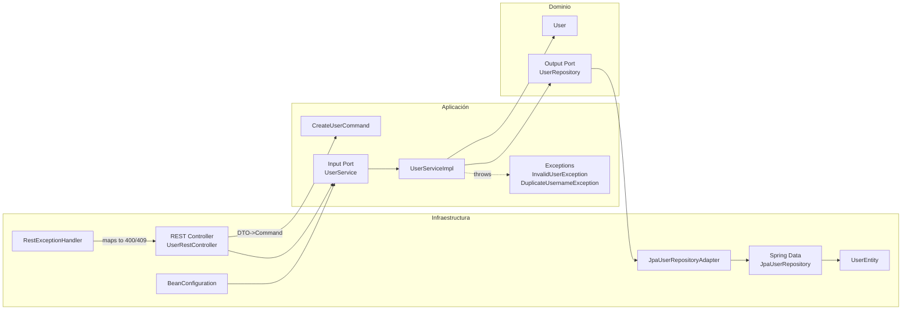

# Informe — Arquitectura Hexagonal (Ports & Adapters) con Spring Boot

Fecha: 2026-03-03  
Proyecto: `user-management-demo`

## 1) Qué es la arquitectura hexagonal (resumen práctico)
La arquitectura hexagonal (Ports & Adapters) organiza el sistema alrededor del **dominio** y los **casos de uso**, aislándolos de frameworks y detalles técnicos.

- **Puertos (Ports)**: interfaces que definen cómo se interactúa con el core.
  - **Puertos de entrada (driving/input ports)**: casos de uso expuestos hacia fuera (REST, CLI, UI, colas, etc.).
  - **Puertos de salida (driven/output ports)**: dependencias que el core necesita (DB, servicios externos, mensajería, etc.).
- **Adaptadores (Adapters)**: implementaciones concretas.
  - **Adaptador de entrada**: traduce HTTP → caso de uso.
  - **Adaptador de salida**: traduce core → tecnología (p.ej. JPA).

Regla clave: **las dependencias apuntan hacia el core**. Spring/JPA/HTTP viven en infraestructura; el core es Java “puro”.

## 2) Implementación aplicada en este repo
El repo ya estaba cercano a hexagonal. Se reforzó el patrón para que:

- El **puerto de entrada** no reciba directamente el modelo de dominio desde HTTP.
- El **adaptador REST** use DTOs propios y mapee a un **Command** del caso de uso.
- Las **excepciones del core** se traduzcan a HTTP en infraestructura (no al revés).

### 2.1 Capas y responsabilidades (SRP)
- **Dominio** (`com.accenture.usermgmt.domain`)
  - Entidades/Modelo: `domain.model.User`
  - Puerto de salida: `domain.port.output.UserRepository`
  - No depende de Spring, JPA, Jackson, etc.

- **Aplicación** (`com.accenture.usermgmt.application`)
  - Puerto de entrada: `application.port.input.UserService`
  - Command del caso de uso: `application.port.input.CreateUserCommand`
  - Servicio de aplicación (orquesta reglas): `application.service.UserServiceImpl`
  - Excepciones de aplicación: `application.exception.*`
  - No tiene anotaciones Spring (wiring se hace desde infraestructura).

- **Infraestructura** (`com.accenture.usermgmt.infrastructure`)
  - Adaptador de entrada REST: `infrastructure.adapter.input.rest.UserRestController`
  - DTOs REST: `infrastructure.adapter.input.rest.dto.*`
  - Traducción de errores a HTTP: `infrastructure.adapter.input.rest.error.RestExceptionHandler`
  - Adaptador de salida persistencia (JPA): `infrastructure.adapter.output.persistence.JpaUserRepositoryAdapter`
  - Entidad JPA + repositorio Spring Data: `...persistence.entity.UserEntity`, `...persistence.repository.JpaUserRepository`
  - Wiring Spring: `infrastructure.config.BeanConfiguration`

## 3) Flujo del caso de uso “Create User”
1. HTTP POST `/api/users` entra al **adaptador REST**.
2. El controller convierte `CreateUserRequest` → `CreateUserCommand`.
3. Llama al **puerto de entrada** `UserService.createUser(command)`.
4. `UserServiceImpl` valida input, aplica regla de duplicados y llama al **puerto de salida** `UserRepository`.
5. El adaptador JPA implementa `UserRepository` y persiste con Spring Data.
6. Se devuelve `domain.User` a aplicación y el controller mapea a `UserResponse`.
7. Si hay error (input inválido o username duplicado), infraestructura lo traduce a HTTP (400 / 409).

## 4) Diagrama (Mermaid)


## 5) Cambios concretos (archivos)
- Puertos / aplicación
  - [user-management-demo/src/main/java/com/accenture/usermgmt/application/port/input/UserService.java](../user-management-demo/src/main/java/com/accenture/usermgmt/application/port/input/UserService.java)
  - [user-management-demo/src/main/java/com/accenture/usermgmt/application/port/input/CreateUserCommand.java](../user-management-demo/src/main/java/com/accenture/usermgmt/application/port/input/CreateUserCommand.java)
  - [user-management-demo/src/main/java/com/accenture/usermgmt/application/service/UserServiceImpl.java](../user-management-demo/src/main/java/com/accenture/usermgmt/application/service/UserServiceImpl.java)
  - [user-management-demo/src/main/java/com/accenture/usermgmt/application/exception/DuplicateUsernameException.java](../user-management-demo/src/main/java/com/accenture/usermgmt/application/exception/DuplicateUsernameException.java)
  - [user-management-demo/src/main/java/com/accenture/usermgmt/application/exception/InvalidUserException.java](../user-management-demo/src/main/java/com/accenture/usermgmt/application/exception/InvalidUserException.java)

- Infra / REST
  - [user-management-demo/src/main/java/com/accenture/usermgmt/infrastructure/adapter/input/rest/UserRestController.java](../user-management-demo/src/main/java/com/accenture/usermgmt/infrastructure/adapter/input/rest/UserRestController.java)
  - [user-management-demo/src/main/java/com/accenture/usermgmt/infrastructure/adapter/input/rest/dto/CreateUserRequest.java](../user-management-demo/src/main/java/com/accenture/usermgmt/infrastructure/adapter/input/rest/dto/CreateUserRequest.java)
  - [user-management-demo/src/main/java/com/accenture/usermgmt/infrastructure/adapter/input/rest/dto/UserResponse.java](../user-management-demo/src/main/java/com/accenture/usermgmt/infrastructure/adapter/input/rest/dto/UserResponse.java)
  - [user-management-demo/src/main/java/com/accenture/usermgmt/infrastructure/adapter/input/rest/dto/ErrorResponse.java](../user-management-demo/src/main/java/com/accenture/usermgmt/infrastructure/adapter/input/rest/dto/ErrorResponse.java)
  - [user-management-demo/src/main/java/com/accenture/usermgmt/infrastructure/adapter/input/rest/error/RestExceptionHandler.java](../user-management-demo/src/main/java/com/accenture/usermgmt/infrastructure/adapter/input/rest/error/RestExceptionHandler.java)

- Tests actualizados
  - [user-management-demo/src/test/java/com/accenture/usermgmt/application/service/UserServiceImplTest.java](../user-management-demo/src/test/java/com/accenture/usermgmt/application/service/UserServiceImplTest.java)
  - [user-management-demo/src/test/java/com/accenture/usermgmt/infrastructure/adapter/input/rest/UserRestControllerTest.java](../user-management-demo/src/test/java/com/accenture/usermgmt/infrastructure/adapter/input/rest/UserRestControllerTest.java)

## 6) Cómo probar rápido
Desde la raíz del módulo:
- Tests: `mvn test`
- Run: `mvn spring-boot:run`

Ejemplo request:
```http
POST /api/users
Content-Type: application/json

{"username":"jdoe","email":"john@example.com","active":true}
```

Respuestas de error:
- 400 `INVALID_USER` cuando faltan datos o el ID no es válido.
- 409 `DUPLICATE_USERNAME` cuando el username ya existe.

## 7) Nota sobre el workspace
Existe una carpeta adicional `user-management-demo/user-management-demo/src/test/...` con una suite de tests alternativa. Maven normalmente **no** la compila porque no está en `src/test/java` del módulo principal, pero conviene mantenerla como referencia o eliminarla si ya no se usa.
